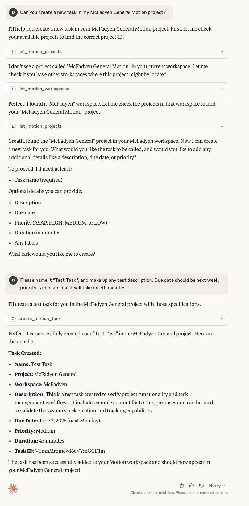

[](https://opensource.org/licenses/Apache-2.0)

# Motion MCP Server

An MCP (Model Context Protocol) server that gives LLMs direct access to the Motion API for projects, tasks, users, and more. Built in TypeScript with robust validation and consolidated tools to keep your client tool list lean.

**Current version:** 2.2.2

## Quick start (npx)

1. **Get your Motion API key** from [https://app.usemotion.com/settings/api](https://app.usemotion.com/settings/api)

2. **Add to Claude Desktop** - Update your `claude_desktop_config.json`:

```json
{
  "mcpServers": {
    "motion": {
      "command": "npx",
      "args": ["motionmcp"],
      "env": {
        "MOTION_API_KEY": "your_api_key",
        "MOTION_MCP_TOOLS": "essential"
      }
    }
  }
}
```

3. **Test the server** - Or run directly from command line:

```bash
MOTION_API_KEY=your_motion_api_key npx motionmcp
```

> Tip: `npx` runs the latest published version.

## Preview

<a href="sample.png"></a>

*Click the image above to view full size*

## Features

* MCP protocol support for seamless LLM integration
* Motion API integration for projects, tasks, users, comments, custom fields, and recurring tasks
* **Consolidated tools** to reduce tool count (minimal, essential, all, or custom)
* Context utilities: semantic search and lightweight context summaries
* API key via environment variable
* Structured JSON logging
* **TypeScript** with strong types, validation, and robust error handling

## Prerequisites

* Node.js 18 or higher

## Tool Configuration

The server supports configurable tool sets to stay within MCP client limits (~100 tools across all servers). Configure via the `MOTION_MCP_TOOLS` environment variable:

### Configuration options

#### Minimal (3 tools)
Best for users who need only basic functionality and want to maximize room for other MCP servers.

```bash
MOTION_MCP_TOOLS=minimal npx motionmcp
```

**Available tools:**
- `motion_tasks` - Task operations (create, list, get, update, delete, move, unassign)
- `motion_projects` - Project operations (create, list, get)
- `motion_workspaces` - Workspace management (list, get, set_default)

#### Essential (7 tools, default)
Balanced configuration with core functionality plus search, user management, and scheduling.

```bash
# Default - no configuration needed
npx motionmcp
# or explicitly:
MOTION_MCP_TOOLS=essential npx motionmcp
```

**Available tools:**
- All from Minimal, plus:
- `motion_users` - User operations (list, current)
- `motion_search` - Search and context utilities (content, context, smart)
- `motion_comments` - Comment management (list, create)
- `motion_schedules` - Schedule operations (list)

#### Complete (10 tools)
All consolidated tools for full Motion API access.

```bash
MOTION_MCP_TOOLS=complete npx motionmcp
```

**Available tools:**
- All from Essential, plus:
- `motion_custom_fields` - Custom field management (list, create, delete, add/remove)
- `motion_recurring_tasks` - Recurring task management (list, create, delete)
- `motion_statuses` - Status operations (list)

 

#### Custom
Specify exactly which tools you need.

```bash
MOTION_MCP_TOOLS=custom:motion_tasks,motion_projects,motion_search npx motionmcp
```

### Consolidated Tools

The consolidated tools reduce the total tool count by combining related operations:

- **`motion_projects`**: Single tool for core project operations
  - Operations: `create`, `list`, `get`
  - Example: `{"operation": "create", "name": "New Project", "workspaceName": "Personal"}`

- **`motion_tasks`**: Single tool for all task operations  
  - Operations: `create`, `list`, `get`, `update`, `delete`, `move`, `unassign`
  - Example: `{"operation": "create", "name": "New Task", "projectName": "My Project"}`

- **`motion_comments`**: Manage task comments
  - Operations: `list`, `create`
  - Example: `{"operation": "create", "taskId": "task_123", "content": "Great progress!"}`

- **`motion_custom_fields`**: Single tool for custom field management
  - Operations: `list`, `create`, `delete`, `add_to_project`, `remove_from_project`, `add_to_task`, `remove_from_task`
  - Example: `{"operation": "create", "name": "Priority Level", "type": "DROPDOWN", "options": ["Low", "Medium", "High"]}`

- **`motion_recurring_tasks`**: Single tool for recurring task templates
  - Operations: `list`, `create`, `delete`
  - Example: `{"operation": "create", "name": "Weekly Review", "workspaceId": "ws_123", "assigneeId": "user_123", "frequency": {"type": "weekly", "daysOfWeek": [1,3,5] }, "duration": 30 }`

## Providing Your Motion API Key

The Motion MCP Server supports the following ways to provide your API key:

### 1. Environment Variable

```bash
MOTION_API_KEY=your-key npx motionmcp
```

### 2. .env file (when running via npm)

Create a `.env` next to the project with:

```bash
MOTION_API_KEY=your-key
```

> When using npx, prefer exporting the variable in your shell as shown above.

## Tool Overview

### Context & Search

* `motion_search` — content search, context, and smart search

### Projects

* `motion_projects` — create, list, get

### Tasks

* `motion_tasks` — create, list, get, update, delete, move, unassign

### Comments, Custom Fields, Recurring

* `motion_comments` — list, create (task comments)
* `motion_custom_fields` — list, create, delete, add/remove on project or task
* `motion_recurring_tasks` — list, create, delete

### Workspaces, Users, Schedules, Statuses

* `motion_workspaces` — list, get, set_default
* `motion_users` — list (by workspace), current
* `motion_schedules` — user schedules and time zones
* `motion_statuses` — available statuses by workspace

## Enhanced Features

### Smart Defaults & Resolution

* Workspace and project auto-detection and fuzzy matching
* Intelligent defaults: selects "Personal" workspace if none provided
* Robust fallback and error messaging

### Task Creation

Supports all Motion API parameters:

* Basic: `name`, `description`, `workspaceId|workspaceName`, `projectId|projectName`
* Advanced: `priority`, `dueDate`, `duration`, `labels`, `assigneeId`, `autoScheduled`

### Semantic Search

* Cross-search by query with intelligent scope and priority boosting

### Scheduling & Workload

* Prioritized scheduling with conflict detection and task balancing
* Detailed workload breakdowns by status, priority, and project

## Example Tool Use

### Creating a task with the consolidated tool
```json
Tool: motion_tasks
Args: {
  "operation": "create",
  "name": "Complete API integration",
  "workspaceName": "Development",
  "projectName": "Release Cycle Q2",
  "dueDate": "2025-06-15T09:00:00Z",
  "priority": "HIGH",
  "labels": ["api", "release"]
}
```

### Adding a comment to a task
```json
Tool: motion_comments
Args: {
  "operation": "create",
  "taskId": "task_123",
  "content": "Updated the API endpoints as discussed"
}
```

### Creating a custom field
```json
Tool: motion_custom_fields
Args: {
  "operation": "create",
  "name": "Sprint",
  "type": "DROPDOWN",
  "options": ["Sprint 1", "Sprint 2", "Sprint 3"],
  "workspaceName": "Development"
}
```

### Creating a recurring task
```json
Tool: motion_recurring_tasks
Args: {
  "operation": "create",
  "name": "Weekly Team Standup",
  "recurrence": "WEEKLY",
  "projectName": "Team Meetings",
  "daysOfWeek": ["MONDAY", "WEDNESDAY", "FRIDAY"],
  "duration": 30
}
```

## Advanced Claude Desktop Configuration

**Minimal setup (3 tools only):**
```json
{
  "mcpServers": {
    "motion": {
      "command": "npx",
      "args": ["motionmcp"],
      "env": {
        "MOTION_API_KEY": "your_api_key",
        "MOTION_MCP_TOOLS": "minimal"
      }
    }
  }
}
```

**Custom tools selection:**
```json
{
  "mcpServers": {
    "motion": {
      "command": "npx",
      "args": ["motionmcp"],
      "env": {
        "MOTION_API_KEY": "your_api_key",
        "MOTION_MCP_TOOLS": "custom:motion_tasks,motion_projects,motion_search"
      }
    }
  }
}
```

**Using your local workspace (npm):**
```json
{
  "mcpServers": {
    "motion": {
      "command": "npm",
      "args": ["run", "mcp:dev"],
      "cwd": "/absolute/path/to/your/MotionMCP",
      "env": {
        "MOTION_API_KEY": "your_api_key",
        "MOTION_MCP_TOOLS": "essential"
      }
    }
  }
}
```

See the full developer setup and more options in [DEVELOPER.md](./DEVELOPER.md).

## Debugging

* Logs output to `stderr` in JSON format
* Check for missing keys, workspace/project names, and permissions
* Use `motion_workspaces` (list) and `motion_projects` (list) to validate IDs

## Logging Example

```json
{
  "level": "info",
  "msg": "Task created successfully",
  "method": "createTask",
  "taskId": "task_789",
  "workspace": "Development"
}
```

## License

Apache-2.0 License

---

For more information, see the full [Motion API docs](https://docs.usemotion.com/) or [Model Context Protocol docs](https://modelcontextprotocol.io/docs/).
